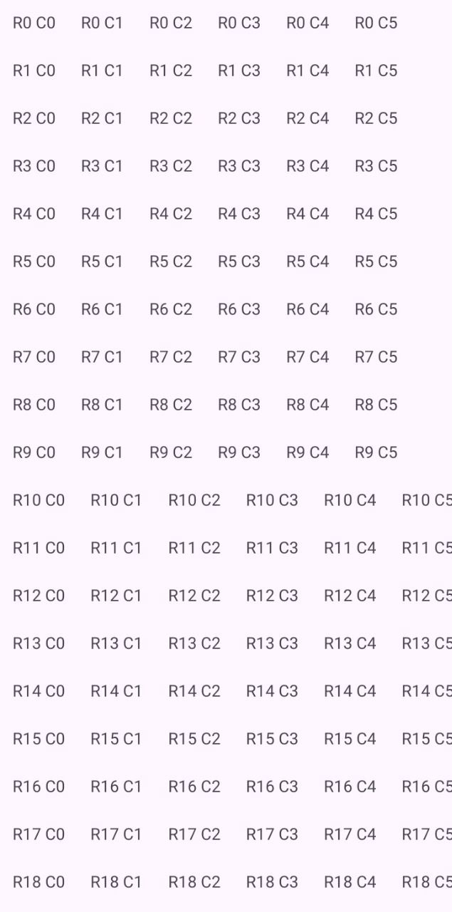
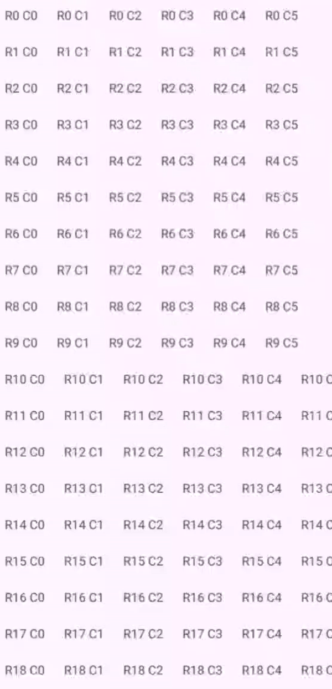

## Android TableView (Kotlin)
[](https://kotlinlang.org/)
[](LICENSE)
[](#)
---

A lightweight, flexible, and customizable TableView library for Android, built using RecyclerView.
It supports sticky headers, horizontal & vertical scrolling, cell click callbacks, and XML-based customization.

Designed for large datasets and clean library integration.

### Features

- Sticky header row (Excel / Google Sheets–like)
- Vertical + horizontal scrolling
- Cell click callbacks (row & column aware)
- XML customization support
- Built as a reusable Android library module
- Kotlin-first, Java compatible
- Optimized RecyclerView architecture

### Preview

<p align="center">
<table>
  <tr>
    <td align="center">
      
    </td>
    <td align="center">
      
    </td>
  </tr>
</table>
</p>

---

## Installation (JitPack)

### 1️⃣ Add JitPack to your **root `settings.gradle` or `build.gradle`**

```gradle
dependencyResolutionManagement {
    repositories {
        google()
        mavenCentral()
        maven { url 'https://jitpack.io' }
    }
}
```
### Add Dependency
```
dependencies {
	        implementation 'com.github.Excelsior-Technologies-Community:Android_TableView:1.0.0'
	}
```

---

### Basic Usage

Add TableView to XML
```xml
<com.ext.tableview.TableView
    android:id="@+id/tableView"
    android:layout_width="match_parent"
    android:layout_height="match_parent"
    app:cellTextSize="14sp"
    app:cellPadding="12dp"
    app:headerBackground="@color/light_gray"
    app:dividerColor="@color/gray" />
```

Create Table Data
```kotlin
val data = List(20) { row ->
    TableRow(
        cells = List(6) { col ->
            TableCell("R$row C$col")
        }
    )
}
```

Set Adapter
```kotlin
val tableView = findViewById<TableView>(R.id.tableView)
val adapter = SampleTableAdapter()

tableView.setTableAdapter(adapter)
adapter.submitList(data)
```

### Example Usage

XML
```xml
<com.ext.tableview.TableView
        android:id="@+id/tableView"
        android:layout_width="match_parent"
        android:layout_height="match_parent"
        app:cellTextSize="13sp"
        app:cellPadding="10dp"
        app:headerBackground="@android:color/holo_orange_light"
        app:dividerColor="@color/black" />
```

KOTLIN
```
class MainActivity : AppCompatActivity() {

    override fun onCreate(savedInstanceState: Bundle?) {
        super.onCreate(savedInstanceState)
        enableEdgeToEdge()
        setContentView(R.layout.activity_main)

        ViewCompat.setOnApplyWindowInsetsListener(findViewById(R.id.main)) { v, insets ->
            val systemBars = insets.getInsets(WindowInsetsCompat.Type.systemBars())
            v.setPadding(systemBars.left, systemBars.top, systemBars.right, systemBars.bottom)
            insets
        }

        val tableView = findViewById<TableView>(R.id.tableView)
        val adapter = SampleTableAdapter()
        tableView.setTableAdapter(adapter)

        val data = createDummyData()
        adapter.submitList(data)

        tableView.setOnCellClickListener { row, col, cell ->
            Toast.makeText(this, "Row $row Col $col = ${cell.value}", Toast.LENGTH_SHORT).show()
        }

        // Sticky header
        val headerAdapter = HeaderAdapter(data.first())
        tableView.setHeaderAdapter(headerAdapter)

    }

    private fun createDummyData(): List<TableRow> {
        return List(20) { row ->
            TableRow(
                cells = List(6) { col ->
                    TableCell("R$row C$col")
                }
            )
        }
    }
}
```

---

### XML Customization Options

| Attribute | Type | Description | Example |
|---------|------|------------|---------|
| `cellTextSize` | dimension | Text size of table cells | `14sp` |
| `cellPadding` | dimension | Padding inside each cell | `12dp` |
| `headerBackground` | color | Background color for header row | `@color/light_gray` |
| `dividerColor` | color | Divider color (future extension) | `@color/gray` |

---

### License

```
MIT License

Copyright (c) 2025 Excelsior Technologies 

Permission is hereby granted, free of charge, to any person obtaining a copy
of this software and associated documentation files (the "Software"), to deal
in the Software without restriction, including without limitation the rights
to use, copy, modify, merge, publish, distribute, sublicense, and/or sell
copies of the Software, and to permit persons to whom the Software is
furnished to do so, subject to the following conditions:

The above copyright notice and this permission notice shall be included in all
copies or substantial portions of the Software.

THE SOFTWARE IS PROVIDED "AS IS", WITHOUT WARRANTY OF ANY KIND, EXPRESS OR
IMPLIED, INCLUDING BUT NOT LIMITED TO THE WARRANTIES OF MERCHANTABILITY,
FITNESS FOR A PARTICULAR PURPOSE AND NONINFRINGEMENT. IN NO EVENT SHALL THE
AUTHORS OR COPYRIGHT HOLDERS BE LIABLE FOR ANY CLAIM, DAMAGES OR OTHER
LIABILITY, WHETHER IN AN ACTION OF CONTRACT, TORT OR OTHERWISE, ARISING FROM,
OUT OF OR IN CONNECTION WITH THE SOFTWARE OR THE USE OR OTHER DEALINGS IN THE
SOFTWARE.
```
